# About

Design files of an interface board for automotive application, the purpose of the board is data acquisition from air pressure sensors, CAN-Bus data sniffing and its relaying through one of the available interfaces.

# Features

* STM32F072 as a control MCU
* One side components placement
* Reverse-polarity protection, over-voltage protection and engine start surge voltage protection as decribed in [here](https://www.ti.com/lit/an/snva717/snva717.pdf)
* Support of two air-pressure sensors with 4-20mA interface
* USBx1
* CANx1
* RS485x1
* Support of extension boards with 2.54mm step (makes prototyping easier)

# Schematics
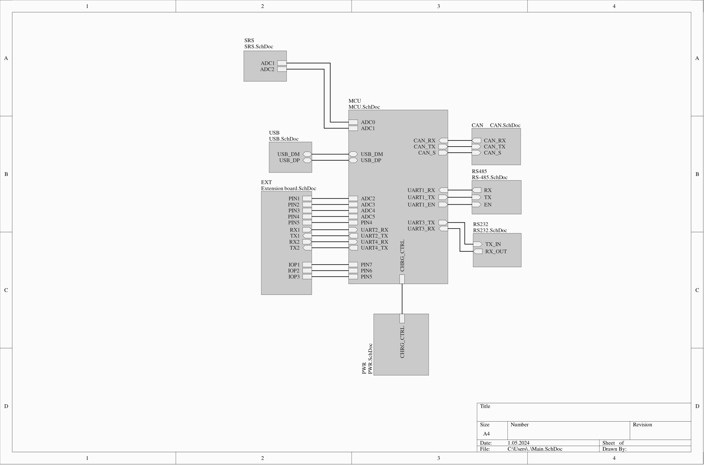
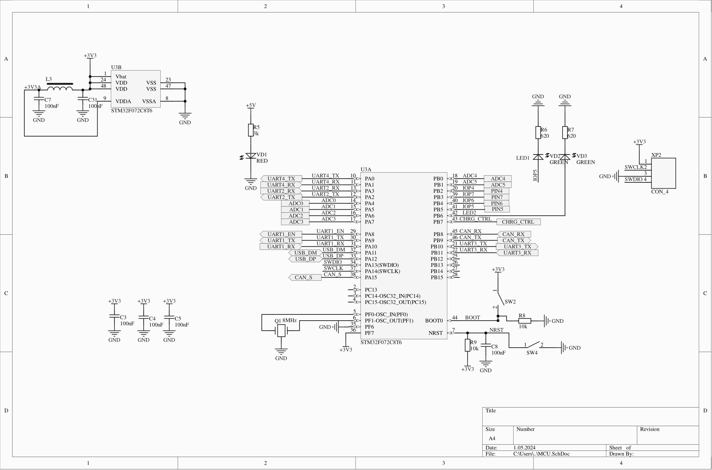
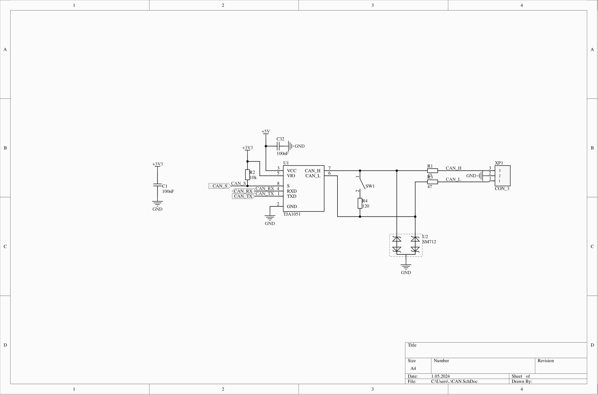
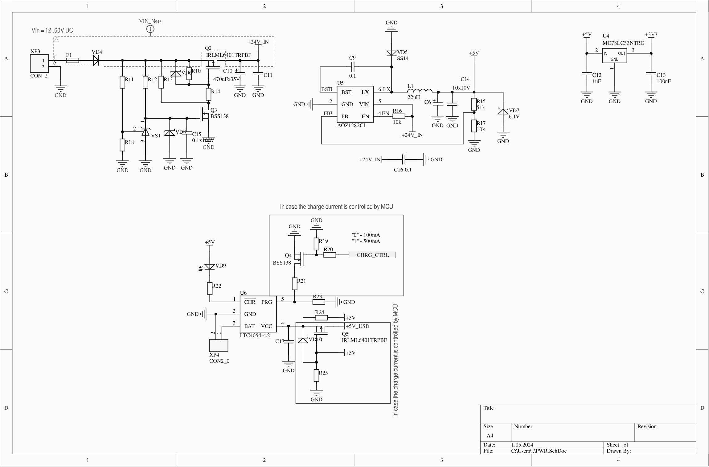
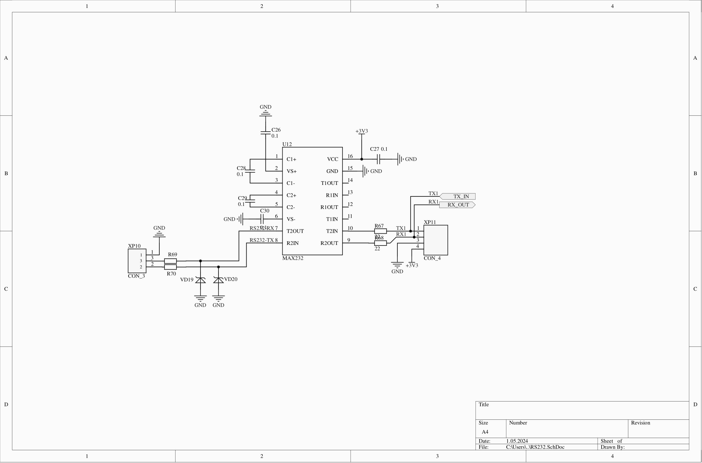
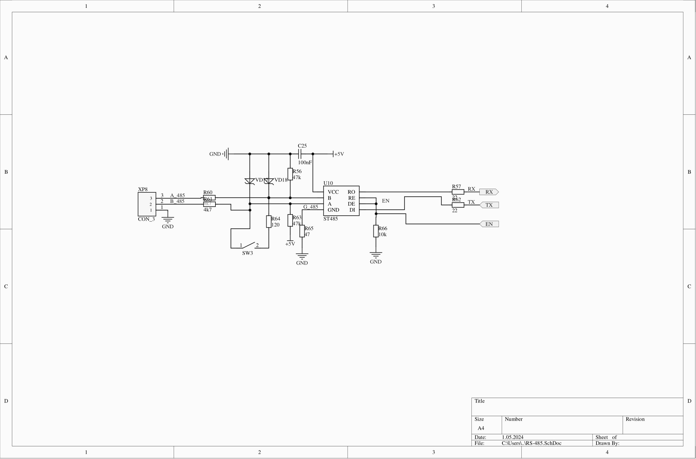
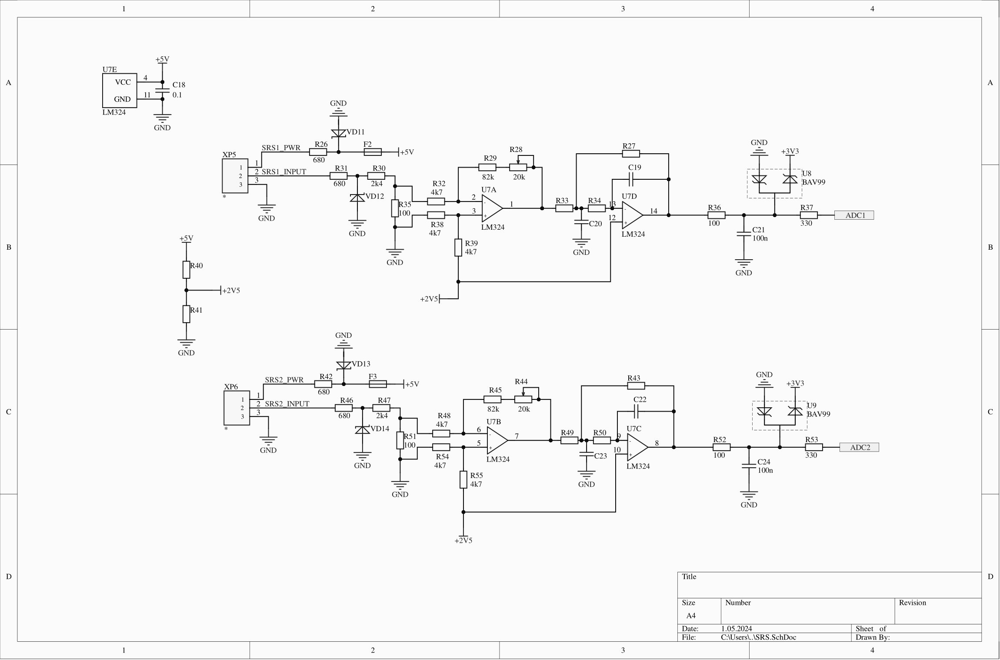
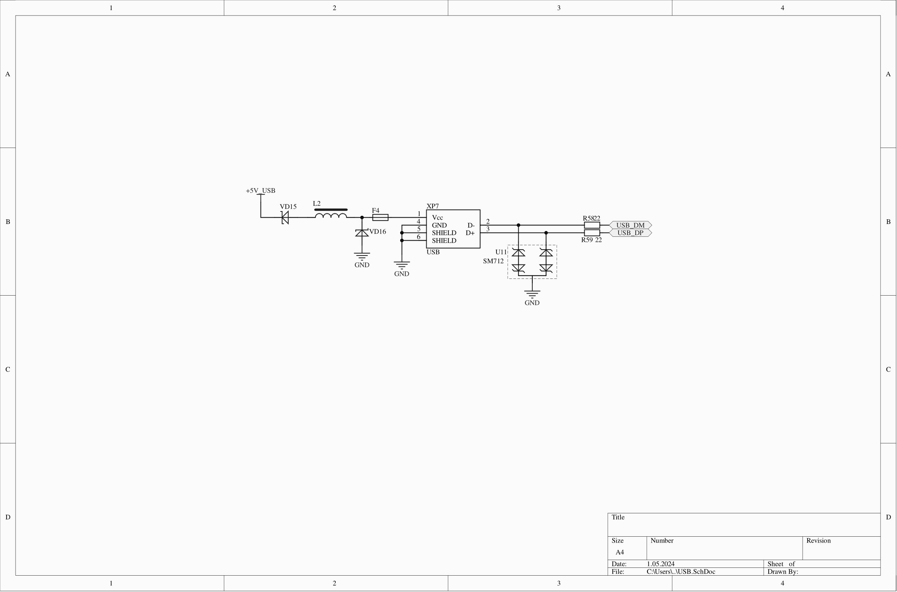
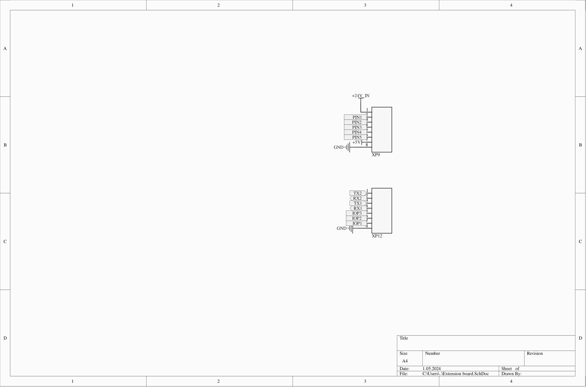

# PCB
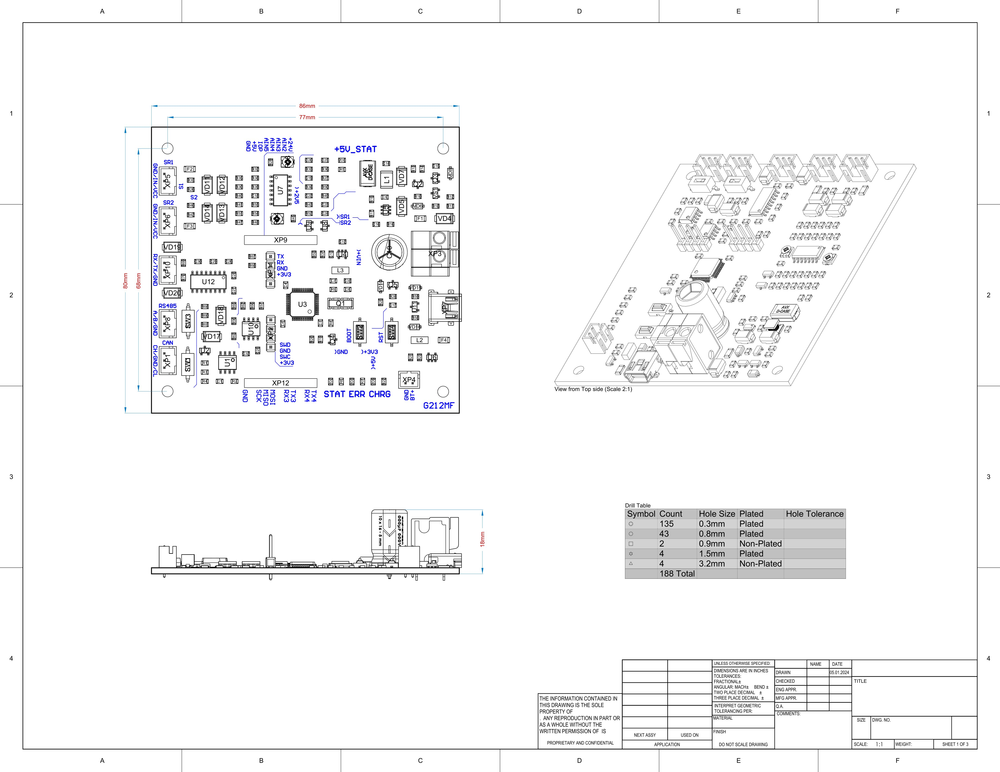
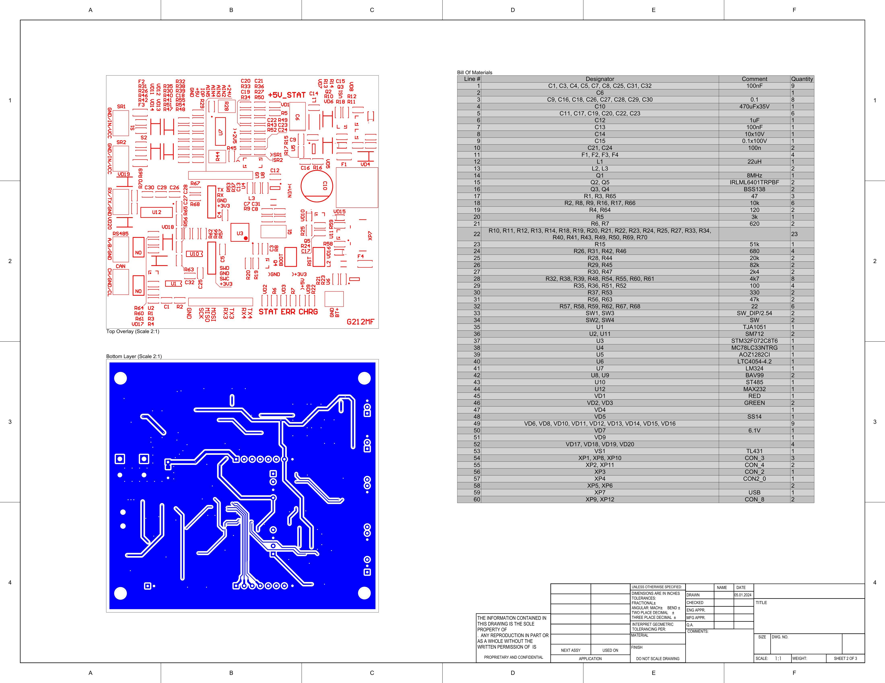
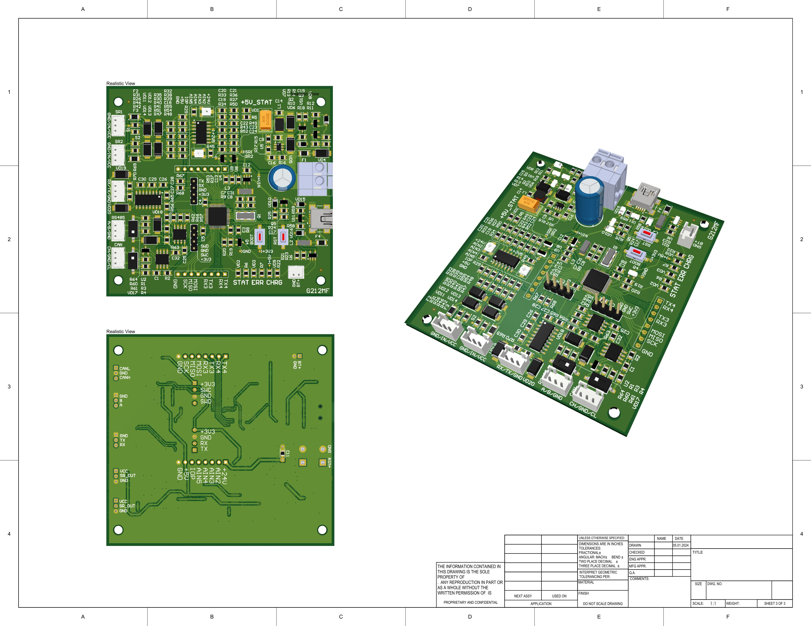

# 3D view
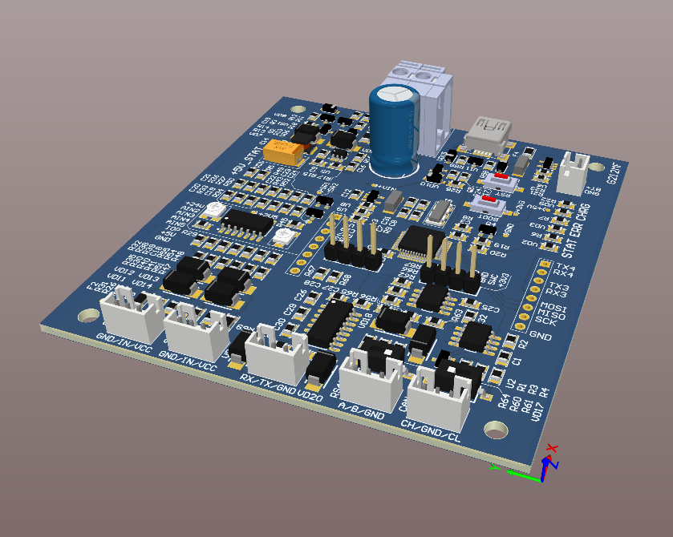
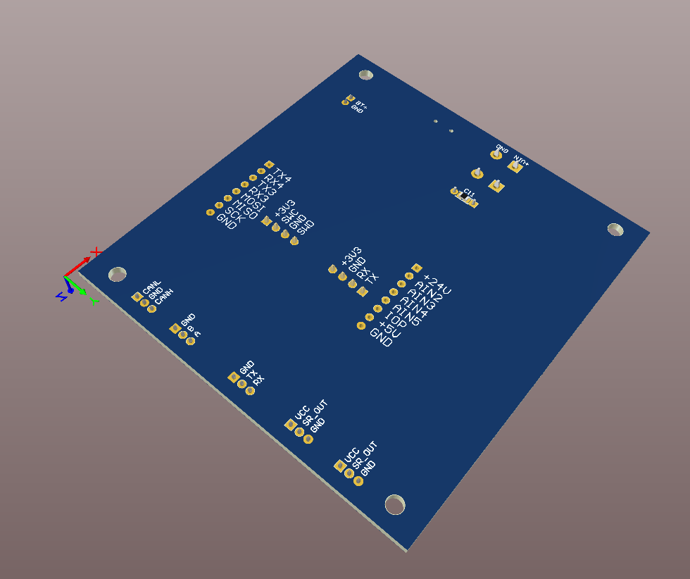

